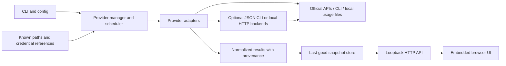

# Quota Watch architecture

Proposed implementation baseline, **2026-09-28**. See [research.md](research.md) for current source evidence and alternative projects. The repository currently contains a Go 1.24 module, a placeholder HTTP application, and unimplemented provider/store interfaces. This document specifies the first working product; it is not an implementation status report.

## Product boundary and MVP

Quota Watch is a single-user local dashboard that discovers supported usage sources and refreshes them without asking the user to type usage numbers. The first release must make the distinction between account quota, API spend and this computer's observed activity obvious. Go owns orchestration, normalization and the UI; optional existing tools may supply data through JSON CLI, HTTP or export interfaces regardless of their implementation language.

The MVP can be completed and tested without real credentials:

- A Go binary serving an embedded, responsive browser UI at `127.0.0.1:7331`, plus health and JSON endpoints.
- Allowlisted discovery with explicit status for Codex, Claude, Gemini, GitHub/Copilot, Cursor and API credentials. Unsupported integrations remain useful status cards with a reason and provider dashboard link.
- Auto-detection of installed CodexBar and ccusage, plus narrow, fixture-tested JSON wrappers for supported provider/source pairs. Prefer these wrappers for maintained usage parsers; missing optional tools must not prevent startup. Additional backends can be detected before their adapters are available.
- Codex rate-limit windows through a constrained CodexBar CLI source when installed, or Codex's documented app-server read as a focused native fallback; local cached observations remain clearly dated. No model request is needed.
- Claude local token observations through ccusage/CodexBar when present; avoid duplicating mature session parsers without a demonstrated need. Support reading a sanitized status-line bridge cache as the path to genuine subscription windows. A helper may be delivered separately without automatically editing Claude settings.
- OpenAI and Anthropic official organization usage/cost adapters when an eligible admin credential is already available; show unknown limits where the provider does not return them.
- GitHub official billing usage where existing credentials permit it. Keep AI credits and legacy premium requests separate. Do not invent a subscription allowance.
- Last-good data preserved across failed refreshes, bounded polling/backoff and a persistent sanitized snapshot cache.
- Explicit `--demo` mode with synthetic examples of healthy, near-limit, exhausted, unknown and stale states. Demo mode performs no discovery, real credential reads or external network requests.

Direct implementation of Gemini consumer quota RPC, Cursor personal session APIs, browser-cookie extraction, inference proxies, billing mutations, cloud deployment, multi-user hosting and account switching are outside the first release. Existing tools can expand coverage under an explicit compatible source policy; wrapping a tool does not convert an internal endpoint into an official one. An adapter can be “discovered but not yet supported” without pretending to have measured usage.

## Structure and dependency flow

Use the standard library wherever practical: `net/http`, `html/template` or embedded static assets, `encoding/json`, `os/exec`, `log/slog`, and filesystem primitives. Do not add a JavaScript build chain just for this dashboard. Keep the existing Go version unless a concrete dependency requires an upgrade.



Suggested package boundaries:

| Path | Responsibility |
| --- | --- |
| `cmd/quota-watch` | Flags, signals, logger, dependency assembly; keep provider logic out |
| `internal/provider` | Shared result types, adapter contract, validation; no adapter imports |
| `internal/providers/<name>` | Provider-specific discovery, requests and parsers, owned fixtures |
| `internal/backends/<tool>` | Optional tool protocol/schema adapters: CodexBar, ccusage, later local HTTP backends |
| `internal/backend` | Shared safe subprocess/loopback HTTP runner and backend metadata, without provider semantics |
| `internal/discovery` | Bounded, allowlisted path/env discovery; process runner abstraction |
| `internal/manager` | Registry, refresh scheduling, per-provider locking and public state |
| `internal/store` | In-memory latest results and atomic JSON cache; no credential persistence |
| `internal/app` | HTTP handlers, request protections and lifecycle |
| `internal/app/web` | Embedded HTML/CSS/JS; no direct provider calls |
| `internal/config` | Defaults and nonsecret options |

Start with an atomic JSON cache and a memory store. A database is unnecessary for a small latest-state dashboard. SQLite becomes appropriate when bounded time-series history and indexed local-file checkpoints are added. The `Store` interface isolates that decision. Do not retain every poll forever.

## Provider contract

Replace the skeleton's boolean discovery result and mandatory numeric values before adapters/UI are developed. A boolean cannot explain why a provider is unavailable, and `float64` zero cannot represent an unknown allowance.

Conceptual contract (the integration owner freezes actual Go names before parallel work):

```go
type Provider interface {
    ID() string
    Discover(context.Context) (Discovery, error)
    Fetch(context.Context) (Result, error)
}

// Discovery contains public metadata and capabilities, never a raw token.
// Result contains account scope, normalized metrics, source and timestamps.
// Credential references and HTTP/process dependencies stay private to adapters.
```

One adapter instance initially represents one configured account/source. Multiple accounts later use separate instances, keyed by provider and opaque account identity. Do not alternate credentials after an authorization failure and accidentally display a different account's data. The adapter chooses source precedence explicitly; errors do not silently enable a more invasive source. A backend is a transport/data supplier, not another provider: Claude data from ccusage and CodexBar must not create two independent allowances or be summed twice.

Inject filesystem roots, an environment lookup, clock, HTTP client and process runner. Unit tests must use temporary homes and synthetic env values. Production origins are fixed/allowlisted; HTTP test endpoints are constructor dependencies, not a public “send my token anywhere” setting.

## Optional backend execution policy

Auto-discover trusted installed executables using a small name allowlist, resolve absolute paths, reject current-directory/shadowed executables and record the resolved version. Do not download, install, update or run package managers during discovery or polling. `npx`, `bunx` and arbitrary shell command strings are not backend protocols. Discovery of an executable is separate from enabling a source with broader credential access.

The first wrapper should support only tested command templates, such as CodexBar's `usage --provider codex --source cli --format json` and local Claude cost command, or ccusage's version-appropriate offline JSON report. Probe versions using a bounded runner and maintain fixtures for supported schemas. Some versions return an array, a wrapper object or per-provider errors; accept documented variants deliberately and reject unknown incompatible structures. Ignore unknown additive fields. A compatible version is a tested range, not a promise that `latest` always works.

Start subprocesses directly with argument arrays and a neutral working directory. Use a provider/backend-specific environment allowlist; do not blindly strip variables needed by a credential helper or blindly pass every secret to every backend. Close stdin, disable interactive/prompt modes where supported, bound stdout/stderr (for example 4 MiB/64 KiB), and apply a deadline. Kill and reap child process groups on cancellation where the OS supports it. Never expose raw stderr; map failures to safe codes. Treat emitted URLs, paths, HTML and identity labels as untrusted data.

Subprocesses normally run with the user's privileges and can read files or access the network. Timeouts and argument validation do not sandbox them. Use available OS sandboxing for truly offline reports when practical, with read-only selected usage roots and no network; do not claim confinement when none was established. Official CLI/keyring modes may require a broader environment and need a documented trust boundary. A backend source selection that cannot prevent browser import, token replay or model probes should remain explicitly configured until reviewed.

For existing local servers, accept only an explicitly configured loopback URL and fixed read paths; disallow redirects and broad URL templates. Use the service's authentication when available, and never forward provider credentials to a generic local endpoint. Keep separate identifiers for backend version, underlying provider source and observation timestamp. Confirm whether a GET is a cached read or initiates outbound work. Add a Unix socket transport later if supported; no port scanning or automatic daemon installation is necessary.

For each account/metric, select one compatible source by a deterministic precedence: configured preferred backend, a safe detected backend with matching scope, then a documented native fallback. Fallback preserves source history and account identity. Two backends may supplement different metrics, but overlapping observations are alternatives, not additive totals.

## Data model

| Field | Semantics |
| --- | --- |
| `provider_id`, `account_id`, `metric_id` | Stable compound identity; no token-derived public identifiers |
| `provider_name`, `account_label`, `plan` | Display metadata; account label optional and privacy-conscious |
| `kind` | `quota`, `usage`, `spend`, `balance` or `activity` |
| `scope` | `account`, `organization`, `project`, `device` or `session`; optional model dimension |
| `label`, `unit`, `currency` | Specific metric name, unit and currency when applicable |
| `used`, `limit`, `remaining`, `used_percent` | Independently nullable; derive only from compatible known quantities |
| `limit_kind` | `finite`, `unlimited` or `unknown`; zero is not unlimited |
| `window_id`, `window_start`, `resets_at`, `window_seconds` | Optional provider window data; never guess a reset from local time |
| `source` | `official_api`, `official_cli`, `local_observation`, `local_estimate`, `demo`; reserve `internal_api` for future opt-in adapters |
| `source_detail`, `coverage` | Safe explanation such as “Codex app-server” or “this device only” |
| `backend_id`, `backend_version` | Tool/protocol supplier, separate from the underlying metric's authority |
| `observed_at`, `fetched_at` | When usage was measured versus when it was retrieved |
| `stale_at`, `partial` | Freshness deadline and incomplete coverage marker |
| `status`, `error` | Provider availability and sanitized error, independent of last-good metrics |

Use UTC RFC3339 in JSON and `time.Time` internally. Use optional pointers for numeric fields in the first Go implementation; validate finite values. Preserve original provider percentages above 100 for overage labels while clamping only visual bar width. Clamp neither authoritative quantities nor factual overages. Fractional credits and fractional cents exist: use decimal strings or a fixed-point monetary type, preserving provider precision; avoid rounding intermediate monetary arithmetic to whole cents.

Important invariants:

1. `null` means unknown. Do not draw an empty 0% bar when no limit is known.
2. Percent-only quota data is valid: `used_percent=35`, `used=null`, `limit=null`. Do not label it “35 of 100 requests.”
3. Distinct subscription windows are independent. They are not additive, and their percentages should not be averaged into a global “quota.”
4. Local token observations are not a subscription quota estimator. Estimated API-equivalent cost is not an invoice.
5. Never sum different currencies, account scopes, overlapping token counters or duplicate provider buckets.
6. A refresh error changes provider health, not the measurement timestamp or stored usage.
7. A passed reset time does not prove that usage became zero. Mark that observation stale and seek a new measurement.

## Discovery and provider behavior

Discovery runs at startup, on an explicit refresh request and periodically at a slower cadence than fetching. It returns states such as `not_detected`, `ready`, `needs_auth`, `permission_required`, `unsupported`, `error`, plus safe setup guidance. Presence and capability are separate.

| Adapter | Discovery | Read behavior and fallback |
| --- | --- | --- |
| Codex | Installed CodexBar/Codex, `CODEX_HOME` or normal user config root | Prefer tested CodexBar CLI-source JSON when present; otherwise resolve a trusted Codex executable and use `codex app-server`. Normalize both to one source identity and do not double count. |
| Claude | Installed ccusage/CodexBar; `CLAUDE_CONFIG_DIR` or default paths; sanitized bridge cache | Use a constrained local JSON report or bridge cache. A native parser is optional; if needed, parse assistant usage only and deduplicate message/request IDs. Missing quota fields remain unknown. |
| OpenAI API | `OPENAI_ADMIN_KEY` or documented Quota Watch alias | Call official usage/cost reads with fixed host and bounded pagination. Distinguish ordinary API key presence from admin eligibility. |
| Anthropic API | `ANTHROPIC_ADMIN_KEY` | Call official usage/cost reads, correct version header, decimal-cent conversion and bounded pagination. No fallback to Claude OAuth. |
| GitHub | named env credentials or installed `gh` credential helper | Determine the authenticated identity, then correct user billing endpoint. Treat 403 as permission/role issue; do not scrape IDE/session tokens. Organization mode requires explicit scope. |
| Gemini / Cursor | Known app/config directory or named admin key presence | First-release card states the supported source and missing capability. No browser-profile or token-database scanning. |

Read metadata only during discovery when possible. Do not dump config files or all environment variables. Native local scans must have depth/file/byte limits, bounded JSONL line size and an incremental strategy. For delegated scans, record the backend's coverage guarantee or lack of one. Do not follow arbitrary symlinks outside the selected root. A truncated scan reports partial coverage; it cannot silently publish a complete total.

Codex JSON protocol needs a bounded line reader, request IDs, handling of out-of-order messages, cleanup on cancellation and no prompt/turn creation. If an older CLI rejects the method, report the missing capability. Do not use a shell to invoke provider executables. Restrict supported calls; preserve enough environment for the official login without sourcing arbitrary project config or scripts.

The optional Claude bridge should read JSON from stdin, retain only rate-window fields, optional aggregate token counts and a timestamp, and atomically write a private cache. It must not preserve prompts, transcript paths or the raw status-line payload. The dashboard only consumes the cache. Installation must be opt-in and compose with an existing status-line command; the MVP must not rewrite user settings on startup.

## HTTP and browser design

The browser/backend boundary is JSON-RPC 2.0. This keeps the UI contract versioned and
also exercises the same request/response discipline used by native RPC-backed provider
adapters such as Codex app-server. Health and static assets remain ordinary HTTP.

Suggested v1 surface:

| Method/path | Result |
| --- | --- |
| `GET /healthz` | Process health; no provider data or secrets |
| `POST /rpc/v1`, `state.get` | Schema version, generation time, mode, provider statuses and latest metrics |
| `POST /rpc/v1`, `refresh.request` | Queue/coalesce an asynchronous refresh and return current refresh state |
| `GET /` and static asset paths | Embedded dashboard |

Keep the wire shape stable and lower_snake_case. Return a top-level object, not a raw JSON array. Serve last-good state immediately, then refresh in the background. A visible tab can poll state every 10–15 seconds; suspend or slow hidden tabs. This is local cache polling, not a reason to contact providers that often. SSE/history endpoints are optional later.

The UI contains a compact header with refresh/freshness, provider cards, and an expandable connection/details area. Each card shows the product/account scope, plan when known, individual window rows, remaining or used value, reset countdown, source badge and age. Unknown values use an em dash with a reason. Offline/errors keep last-good numbers visibly stale. Show unsupported providers with a short explanation and a provider link; do not fabricate demo data in normal mode. Demo mode has a persistent banner.

Provide semantic headings, labeled progress bars, keyboard focus, sufficient contrast, reduced-motion support and status conveyed in text as well as color. Use `textContent` or escaped templates for provider-controlled text. A provider breakdown is more useful than a global percentage; summary counts can say “2 need attention” and “4 connected.”

## Polling, errors and persistence

- Suggested starting defaults: quota refresh every 2 minutes; delayed billing reports every 15 minutes; local observations every 30–60 seconds; discovery every 5 minutes. These are application defaults, not provider guarantees.
- Bound concurrency (for example 3 adapters); one in-flight fetch per account/source. Coalesce manual refreshes and keep a minimum provider interval.
- Apply a context deadline to every operation: e.g. 15 seconds for HTTP and 20 seconds for CLI reads. Shut down workers and subprocesses on cancellation.
- Respect `Retry-After` and provider limits. Back off transient failures with jitter, capped at a reasonable interval. Auth errors pause frequent requests until credentials change or the user retries.
- Distinguish timeout/offline, authentication, permission, throttling, malformed response and unsupported schema. Return a typed safe code and short actionable message; never raw request headers, bodies or CLI stderr.
- Paginate until complete within page/byte/time limits. If incomplete, either keep the last complete total or explicitly mark partial; never display partial spend as a final account total.
- Cache by provider/account/metric identity. Write private directories (`0700`) and files (`0600`) using an atomic temp-file rename. A corrupt cache is reported and ignored without overwriting it as the first recovery action.
- Keep `last_attempt`, `last_success` and original measurement time independently. Cache contains normalized usage only. Disable disk cache if safe persistence is unavailable; the UI may still run with a visible warning.

## Security boundaries

Bind loopback by default and reject unexpected Host headers to reduce DNS-rebinding exposure. Check Origin for mutation-like local operations, deny cross-origin access and require an anti-CSRF token or same-origin custom header for refresh/config writes. Avoid wildcard CORS. Add a restrictive Content Security Policy with local assets, `X-Content-Type-Options: nosniff`, and `Cache-Control: no-store` on usage responses. Remote access is not a flag to casually enable: it requires a separate authenticated deployment design.

Credentials never appear in JSON, HTML, URLs, logs, telemetry or snapshot files. Use explicit outbound hosts and refuse cross-origin redirects carrying authorization. Default HTTP errors expose safe status codes, not response bodies. Only permit known read endpoints and no generation calls. Do not refresh/rewrite another application's tokens directly. The official CLI may manage its own cached login, which must be disclosed. Use a neutral subprocess directory and avoid loading unrelated project extensions/hooks.

Local-only does not eliminate risk from other local processes or malicious browser origins. Avoid putting full email addresses or repository paths in default cards. No telemetry, update installer, shell command plugin, arbitrary HTTP adapter or cookie import is required for this release.

## Verification and release criteria

All default tests must be credential-free and network-independent. Use temporary directories, fake environment lookups, fixture subprocesses and `httptest` servers. Backend tests use synthetic executables/runner responses, not the developer's installed tool or account. Add focused tests for actual risks:

- Codex initialization, multiple limit buckets, legacy fallback, out-of-order responses, missing fields, malformed records, reset timestamps and subprocess cancellation.
- Optional backend absent/present/version mismatch, fixed argument construction, output bounds, hung child cancellation, nonzero exit with partial JSON, source-policy mismatch, backend/native deduplication and local-server redirect rejection.
- Claude deduplication, missing usage, unknown models, oversized/partial JSONL, bridge timestamps and absence of rate-limit fields.
- API pagination, fractional monetary units, insufficient permission, 429 retry hints, timeout, malformed responses and redirect rejection.
- Unknown versus zero/unlimited rendering; stale values after failed refresh; passed resets; demo isolation; escaped hostile display strings.
- Cache round-trip/permissions/corruption and concurrent refresh safety; loopback/Host/Origin protections and secret-free responses/logs.

Run `go test ./...`, `go test -race ./...`, `go vet ./...` and a normal build. Use a browser or a small HTTP smoke check against demo mode to verify startup, state, refresh, layout and empty/error states. Tests passing against fixtures establish parser and application behavior, not successful live provider authentication; state that limitation in the release notes.

## Implementation phases and parallel work packages

**Phase 0: freeze the shared contract.** The integration owner settles Go types, JSON field names, constructor dependencies, store semantics and manager/HTTP interfaces. Keep production changes to that small common surface before delegating; publish a representative synthetic state response for frontend work.

**Phase 1: three implementation agents, plus one integration/review owner.** This matches four available concurrency slots and avoids overlapping edits:

| Work package | Exclusive ownership | Deliverable / handoff |
| --- | --- | --- |
| A — Core runtime | `internal/manager`, `internal/store`, `internal/config`, `cmd/quota-watch`; root dependency files only by agreement | Scheduler, cache, signal handling, flags/demo isolation and concurrency/error tests. Exposes stable state and refresh methods. |
| B — Backends and sources | `internal/backend`, `internal/backends`, `internal/providers`, `internal/discovery`, owned fixtures | Safe runner, CodexBar/ccusage JSON adapters first; focused native fallbacks and official APIs where they add coverage. Returns backend capabilities and provider registry to the integration owner. |
| C — HTTP and UI | `internal/app`, embedded assets, handler/UI tests | Responsive cards, provenance/unknown/stale states, JSON API, refresh protection and demo visual verification. Consumes the frozen model only. |
| Integration owner | `internal/provider` shared contract, README, final wiring coordination, research/architecture alignment | Resolve interface drift, review security and unsupported claims, run complete checks and final smoke test. |

Agents must request shared-type changes through the integration owner. They must not run account login, edit user CLI settings, use real credentials or install provider software for tests. Each reports changed paths, checks run and known limits. Implement the narrow reusable backend path before duplicating provider internals. If adapter work becomes the bottleneck, add a second sequential wave splitting official API adapters from backend integrations; do not create more simultaneous overlapping owners.

**Phase 2:** additional existing-tool/local-server adapters, opted-in Claude status-line installation, official Cursor team and Google Cloud adapters where no suitable backend exists, account selection, compact history and alerts. Validate real authorized accounts separately before advertising support.

**Phase 3:** optional external adapter protocol and wider subscription metrics. Treat any internal API integration as an explicit experimental source with its own documentation, host allowlist, fixture suite and disable switch. Do not let it silently become the fallback for a broken official source.
